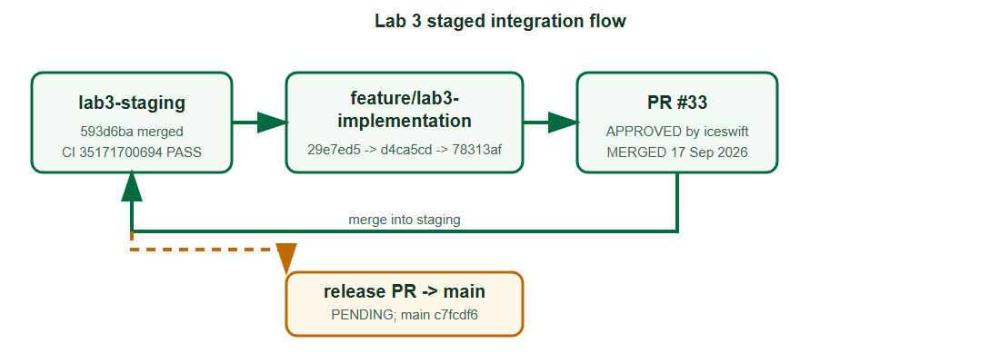

# Sprint 3 branch flow

Lab 3 follows the Lab 2 staged integration flow. The contract and implementation
were developed on a feature branch, reviewed in PR #33, and merged into the
published lab3-staging branch. The resulting staging commit passed the full
TokTickIT CI workflow. The release from lab3-staging to main is still a
separate pending delivery gate.

    lab3-staging (bdd1265 baseline)
        |
        +-- feature/lab3-implementation
              29e7ed5  docs: establish Lab 3 contract before implementation
              d4ca5cd  feat: implement Lab 3 authenticated ticket workflows
              ...     tests and evidence follow-up commits
              78313af  final reviewed feature-branch tip
              |
              +-- PR #33 -> lab3-staging  [APPROVED; MERGED]
                                          merge 593d6ba
                                          staging CI 35171700694 [PASS]
                                          |
                                          +-- release PR to main [PENDING]
                                              main remains c7fcdf6 (Lab 2)

The contract baseline 29e7ed5 is an ancestor of the implementation d4ca5cd,
so specification-before-implementation order is visible in the branch history.
PR #33 received a changes-requested review from iceswift, the Administrator
detail authorization fix was added, and the reviewer subsequently approved the
final feature tip 78313af before the merge commit 593d6ba was created.

| Step | Branch or PR | Current evidence | State |
|---|---|---|---|
| 1 | lab3-staging | bdd1265 baseline | Published baseline |
| 2 | feature/lab3-implementation | 29e7ed5 precedes d4ca5cd; final tip 78313af | Feature work reviewed |
| 3 | PR #33 | feature/lab3-implementation -> lab3-staging | Approved and merged; merge 593d6ba |
| 4 | Staging CI | [Run 35171700694](https://github.com/Richyboy170/toktickit/actions/runs/35171700694) | Server, client, and E2E jobs passed |
| 5 | lab3-staging -> main | Current main: c7fcdf6 | Release PR and final-main CI pending |
| 6 | Issues #34-#40 | [Issue list](https://github.com/Richyboy170/toktickit/issues) | Still open; not yet Done |

Remote references:

- [lab3-staging at merge 593d6ba](https://github.com/Richyboy170/toktickit/tree/593d6ba49f442d8c46b6be01cde8fa09285ecf50)
- [feature/lab3-implementation at 78313af](https://github.com/Richyboy170/toktickit/tree/78313af684264c9eb46931dca42793407207d5a6)
- [PR #33](https://github.com/Richyboy170/toktickit/pull/33)
- [staging CI run 35171700694](https://github.com/Richyboy170/toktickit/actions/runs/35171700694)
- [current main](https://github.com/Richyboy170/toktickit/tree/main)

